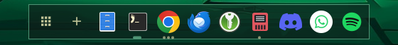
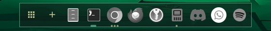
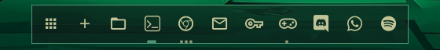

# straw.dock

Themed application dock for the Omarchy shell (a keep-loaded `panel` plugin).

The three `iconStyle`s, shown on the Osaka Jade theme:

| style | |
|---|---|
| `original` |  |
| `mono` |  |
| `line` |  |

- Pinned apps plus running apps. Click to launch, or to focus a single window
  (this switches to its workspace). With 2+ windows, click opens a picker with
  live previews.
- Middle-click: new window. Right-click: window list, desktop actions,
  pin/unpin, close. Scroll: cycle the app's windows. Drag pinned icons to reorder.
- New-workspace button (`showNewWorkspace`): click jumps to an empty workspace
  on the monitor the dock is on. With more than one monitor, middle-click
  opens a menu to pick which monitor gets the new workspace (names come from
  `monitorNames` when set).
- Right-click the dock background (or the app-grid button) for settings.
- Colors, borders, font and corner radius follow the current Omarchy theme.

> **Why a dock on Omarchy?** Omarchy is built around the keyboard, and a
> mouse-driven dock goes against that on purpose. Not everyone wants to
> memorise a long list of shortcuts, though. This plugin is for people who
> just want their apps and windows one click away. Your keybindings keep
> working as before, and you can hide the dock (`autoHide`) or disable the
> plugin at any time.

## Settings

Stored inline on the `straw.dock` entry in `~/.config/omarchy/shell.json`
under `plugins[]` (hot-reloads on save):

| key | default | values |
|---|---|---|
| `position` | `"bottom"` | `bottom`, `left`, `right` |
| `iconSize` | `48` | 24–128 |
| `magnification` | `true` | bool |
| `magnifyScale` | `1.6` | 1–2.5 |
| `autoHide` | `"smart"` | `never` (reserves space), `smart` (hide when a window touches it), `always` |
| `windowScope` | `"all"` | `all`, `monitor`, `workspace` |
| `previews` | `true` | bool |
| `showLauncher` | `true` | bool |
| `showNewWorkspace` | `true` | bool — button that jumps to an empty workspace on that monitor (middle-click: choose the monitor) |
| `showRunning` | `true` | bool |
| `border` | `true` | bool — theme border around the dock |
| `iconStyle` | `"original"` | `original`, `mono` (tinted), `line` (outline glyphs) |
| `monitors` | `"all"` | `"all"`, `"main"`, or `["DP-1", ...]` |
| `mainMonitor` | `""` | output name for `"main"`; empty = monitor holding workspace 1 |
| `monitorNames` | `{}` | friendly names shown instead of output names, e.g. `{ "DP-1": "Left" }` |
| `opacity` | `0.92` | 0–1 |
| `margin` | `8` | px from the screen edge |
| `pinned` | foot, Nautilus, Chrome, Code, Spotify, Obsidian | desktop ids |

## Icon styles

`line` draws outline glyphs from the shell's Nerd Font in the theme color
(rules in `DockModel.js` → `GLYPH_RULES`); apps without a glyph fall back to
`mono`, which tints the app's own icon. To override any app's icon in these
styles, drop an SVG/PNG in `~/.config/omarchy/dock-icons/` named after its
desktop id or window class (e.g. `obsidian.svg`); it's drawn as a silhouette
in the theme color.

## IPC

```
omarchy-shell dock reveal | openSettings | closePopups
omarchy-shell dock setPosition left|bottom|right
omarchy-shell dock setIconSize 56
omarchy-shell dock setAutoHide never|smart|always
omarchy-shell dock setBorder true|false
omarchy-shell dock setIconStyle original|mono|line
omarchy-shell dock newWorkspace [monitor]   # empty = focused monitor
omarchy-shell dock setMonitorName DP-1 "Left"   # empty name = back to DP-1
omarchy-shell dock setMonitors all|main|DP-1,DP-3
omarchy-shell dock setMainMonitor DP-1
omarchy-shell dock pin <desktop-id> | unpin <desktop-id>
omarchy-shell dock showWindows <desktop-id> | showMenu <desktop-id>
omarchy-shell dock settings
```

## Install

```
omarchy plugin add https://github.com/gregluffy/strawdock.git --enable --yes
```

Or by hand, then enable it:

```
git clone https://github.com/gregluffy/strawdock.git ~/.config/omarchy/plugins/straw.dock
omarchy-shell shell rescanPlugins && omarchy plugin enable straw.dock
```

## Disclaimer

straw.dock is an independent community plugin for the Omarchy shell (Quickshell).
It is not affiliated with or endorsed by the Omarchy project. It is provided
as is, without warranty of any kind. Omarchy's plugin API may change between
releases and break the dock, so check back here if something stops working
after an update. Everything stays on your machine: the dock talks to
Hyprland through `hyprctl` (list, focus and close windows), launches apps,
scans your local icon folders, and saves its settings to its own entry in
`~/.config/omarchy/shell.json`. It makes no network requests.

## License

MIT — see [LICENSE](LICENSE).
